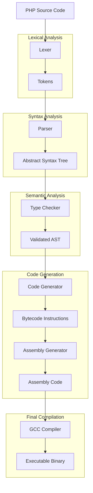

# TinyPHP-RS

A tiny PHP subset compiler written in Rust. This project compiles a subset of PHP to x86-64 assembly, which is then compiled to an executable using GCC.

## Overview

TinyPHP-RS is a compiler that translates PHP code into executable binaries through a multi-stage compilation process. The compiler supports a subset of PHP features including variables, basic arithmetic operations, control flow statements, and simple I/O.

## Data Flow

The following diagram illustrates the data flow through the TinyPHP-RS compiler system:



## Compilation Stages

1. **Lexical Analysis**: The source code is tokenized by the lexer, which converts the raw text into a sequence of tokens.

2. **Syntax Analysis**: The parser converts the token stream into an Abstract Syntax Tree (AST), which represents the hierarchical structure of the program.

3. **Semantic Analysis**: The type checker validates the AST, ensuring that operations are type-safe and semantically correct.

4. **Code Generation**:
   - The code generator converts the AST into bytecode instructions.
   - The assembly generator translates these instructions into x86-64 assembly code.

5. **Final Compilation**: GCC compiles the assembly code into an executable binary.

## Project Structure

- `src/`: Source code for the compiler
  - `lexer.rs`: Tokenizes PHP source code
  - `parser.rs`: Parses tokens into an AST
  - `typechecker.rs`: Validates the AST
  - `codegen.rs`: Generates bytecode instructions
  - `asmgen.rs`: Generates assembly code
  - `error.rs`: Error handling utilities
  - `ast.rs`: AST data structures
  - `lib.rs`: Main library interface
  - `main.rs`: Command-line interface

- `tests/`: Test scripts and utilities
  - `scripts/`: PHP test scripts
  - `output/`: Compiled executables and assembly files

## Usage

### Compiling a PHP Script

```bash
cargo run --bin tinyphp-rs <input.php> [output.exe]
```

Or use the provided PowerShell script:

```powershell
.\compile_test.ps1 <script_name>
```

### Running a Compiled Script

```bash
./<output.exe>
```

Or use the provided PowerShell script:

```powershell
.\run_test.ps1 <script_name>
```

## Testing

The `tests/` directory contains test scripts and utilities for testing the compiler. See `tests/README.md` for more information.

## License

This project is licensed under the MIT License - see the LICENSE file for details.
